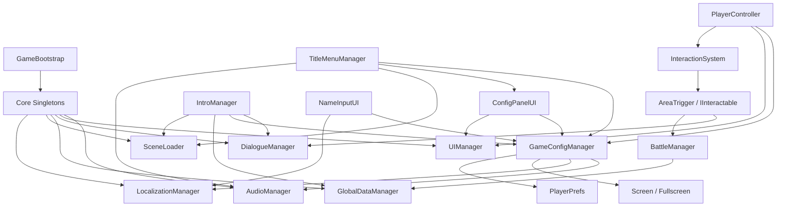

# HubToHome 아키텍처 메모

> 기준 시각: 2026-05-10 (KST)  
> 초점: 최근 추가된 설정 시스템과 기존 타이틀/인트로/오버월드 루프의 연결 관계

## 현재 구조 요약

- `GameBootstrap`과 코어 싱글턴들이 게임 전역 서비스를 올립니다.
- `DialogueManager`, `UIManager`, `AudioManager`, `LocalizationManager`, `SceneLoader`, `GlobalDataManager`가 초반 UX와 오버월드/전투 루프의 공용 기반입니다.
- 최근 변경의 핵심은 `GameConfigManager`와 `ConfigPanelUI`를 추가해 "설정/입력/언어" 책임을 별도 계층으로 꺼내기 시작한 점입니다.

## 최근 추가/수정된 핵심 클래스

### 설정 계층

- `GameConfigManager`
  - 볼륨, 전체화면, 언어, 키 바인딩을 `PlayerPrefs`에 저장
  - `AudioManager`, `LocalizationManager`, `Screen`에 즉시 반영
  - `EnsureInstance()`로 타이틀/인트로 어디서든 독립적으로 기동 가능

- `ConfigPanelUI`
  - 설정 메뉴의 실제 UI 패널
  - 볼륨 조절, 키 변경, 언어 변경, 전체화면 토글, 기본값 복구 제공
  - `UIManager`가 있으면 패널 스택에 올라가고, 없으면 자체적으로 표시 가능

### 최근 통합 지점

- `TitleMenuManager`
  - 시작 시 `GameConfigManager`를 보장
  - `Settings` 버튼으로 `ConfigPanelUI`를 열 수 있음
  - 확인 입력이 `ConfigurableAction.Confirm`을 보기 시작함

- `PlayerController`
  - 이동/확정/메뉴 입력 일부가 설정 기반 입력과 병행됨

- `UIManager`
  - 패널 닫기 입력이 `ConfigurableAction.Cancel`을 사용

- `IntroManager`, `NameInputUI`
  - 언어 전환이 `GameConfigManager.SetLanguage(...)`를 타도록 조정됨

## 의존 관계

## 시스템 설명

### 1. 부트스트랩과 전역 서비스

`GameBootstrap`이 코어 싱글턴을 띄우고, 이후 씬 전환이 일어나도 `AudioManager`, `UIManager`, `DialogueManager`, `GlobalDataManager`, `LocalizationManager` 같은 서비스는 살아남습니다. 이 구조 덕분에 타이틀, 인트로, 오버월드, 전투가 같은 전역 상태를 공유합니다.

### 2. 새 설정 계층

이번 변경으로 설정은 더 이상 각 화면에서 따로 들고 있지 않고, `GameConfigManager`가 저장/적용 책임을 모읍니다. `ConfigPanelUI`는 이 매니저의 값을 읽고 수정하는 프런트엔드 역할입니다. 방향성은 좋지만, 패널 입력과 패널 텍스트는 아직 이 계층에 완전히 흡수되지 않았습니다.

### 3. 플레이 루프

- 타이틀: `TitleMenuManager`가 시작점이며, 새 게임 진입과 설정 패널 호출을 담당합니다.
- 인트로: `IntroManager`가 `DialogueManager`와 `NameInputUI`를 사용해 이름 입력이 포함된 도입부를 진행합니다.
- 오버월드: `PlayerController`와 `InteractionSystem`이 탐색과 상호작용을 처리하고, `AreaTrigger`가 씬 전환이나 전투 진입을 분기합니다.
- 전투: `BattleManager`가 전투 루프의 중심이며, 결과 데이터는 `GlobalDataManager`로 돌아갑니다.

## 현재 결합 문제 / 기술 부채

- `ConfigPanelUI`는 새 설정 시스템을 사용하지만, 자체 입력은 아직 하드코딩이라 설계가 절반만 옮겨졌습니다.
- 언어 단축키 로직이 `IntroManager`와 `NameInputUI`에 중복돼 있습니다.
- `TitleMenuManager`의 `Continue`는 UI만 존재하고 실제 저장 복구 경로가 없습니다.
- `DialogueUI`의 선택지 입력도 `Z/X/C` 고정이라, 설정 계층과 장기적으로 충돌할 가능성이 있습니다.
