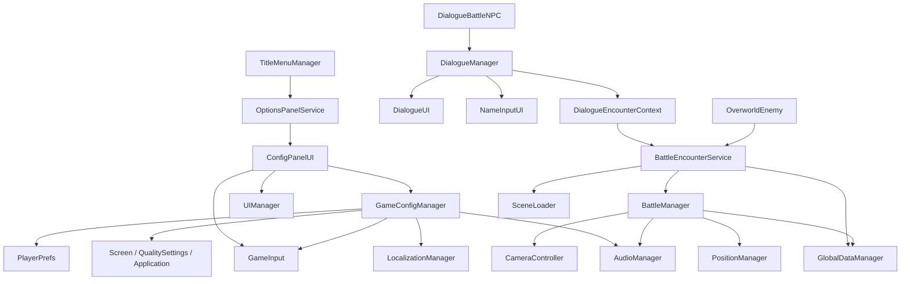

# HubToHome 아키텍처 메모

> 기준 시각: 2026-05-10 (KST)  
> 초점: 최근 수정된 설정/입력 계층과 오버월드 조우 -> 대화 -> 전투 연결선

## 현재 구조 한눈에 보기

- 코어 전역 서비스는 여전히 `AudioManager`, `LocalizationManager`, `UIManager`, `GlobalDataManager`, `SceneLoader`, `DialogueManager` 축으로 유지됩니다.
- 오늘 구조 변화의 핵심은 두 갈래입니다.
  - `GameConfigManager + GameInput + ConfigPanelUI`: 설정과 키 바인딩을 공통 계층으로 끌어올림
  - `BattleEncounterService + DialogueEncounterContext + OverworldEnemy`: 전투 진입을 공통 서비스로 정리함

## 최근 수정된 핵심 클래스와 책임

| 클래스 | 최근 핵심 역할 | 주요 의존 대상 |
| --- | --- | --- |
| `GameConfigManager` | 설정 저장, 즉시 적용, 키 리바인딩 저장 | `AudioManager`, `LocalizationManager`, `Screen`, `PlayerPrefs`, `GameInput` |
| `GameInput` | Player/UI/Battle/Dialogue/Config 액션맵 파사드 | `InputSystem_Actions`, `GameConfigManager` |
| `ConfigPanelUI` | 설정 패널 UI, 카테고리/행 탐색, 키 캡처 | `GameInput`, `GameConfigManager`, `LocalizationManager`, `UIManager` |
| `BattleEncounterService` | 오버월드/대화 공통 전투 진입 오케스트레이션 | `GlobalDataManager`, `BattleManager`, `SceneLoader` |
| `DialogueEncounterContext` | 대화 선택지 전투용 런타임 컨텍스트 | `DialogueManager`, `BattleEncounterService` |
| `DialogueManager` | 대사 재생, 선택지 분기, 이름 입력, 선택지 전투 호출 | `DialogueUI`, `NameInputUI`, `BattleEncounterService` |
| `DialogueBattleNPC` | 대화형 NPC에서 전투 컨텍스트 전달 | `DialogueManager`, `DialogueData` |
| `OverworldEnemy` | 순찰형 적, 접촉 전투, 복귀 쿨다운, 영속 상태 연계 | `EnemyCharacter`, `BattleEncounterService`, `GlobalDataManager` |
| `BattleManager` | 실제 전투 유닛 세팅, 심리스/전용 씬 전투, 조우 결과 기록 | `GlobalDataManager`, `AudioManager`, `PositionManager`, `SceneLoader` |

## 최근 추가된 함수 레벨 연결 포인트

- `GameConfigManager.ApplyAll()`
  - 저장된 옵션을 오디오, 언어, 전체화면, VSync, FPS에 즉시 반영합니다.
- `GameConfigManager.SetKey(...)`
  - 저장 후 `GameInput.RefreshKeyBindings()`를 호출해 런타임 입력 매핑을 갱신합니다.
- `ConfigPanelUI.CaptureKey()`
  - 설정 패널 내부에서 새 키를 읽고 중복 키를 막은 뒤 `GameConfigManager`에 저장합니다.
- `BattleEncounterService.StartEncounter(...)`
  - 전투 전 공통 컨텍스트(`PendingEnemies`, `PendingBattleBGM`, `LastOverworldScene`, `EncounterId`)를 적재하고, 심리스 전투 또는 배틀 씬 로드로 분기합니다.
- `DialogueManager.CoStartBattleFromChoice(...)`
  - 선택지 데이터를 소비한 뒤 `DialogueEncounterContext`를 `BattleEncounterService`에 전달합니다.
- `OverworldEnemy.StartSceneBattleRoutine()`
  - 순찰 적에서 전투 진입 직전 잠금, SFX, 콜라이더 비활성화, 플레이어 배틀 모드 전환을 수행합니다.
- `BattleManager.CommitOverworldEncounterResult(...)`
  - 승리/도주 결과를 `GlobalDataManager`에 기록해 오버월드 적의 후속 상태를 결정합니다.

## 의존 관계

## 시스템 해설

### 1. 설정/입력 계층

이제 설정은 개별 UI가 직접 자기 값을 들고 있는 구조가 아닙니다. `GameConfigManager`가 저장과 적용 책임을 가지며, `GameInput`이 그 결과를 실제 입력 액션에 반영합니다. `ConfigPanelUI`는 이 계층의 프런트엔드입니다. 구조 자체는 맞게 잡혔고, 남은 일은 문자열 현지화와 세부 옵션 마감입니다.

### 2. 전투 진입 계층

전투 시작 책임도 분산 상태에서 한 번 모이기 시작했습니다. 오버월드 접촉 적이든, 대사 선택지 전투든 결국 `BattleEncounterService.StartEncounter(...)`를 통과합니다. 이 덕분에 BGM 선택, 복귀 씬 기록, 적 목록 전달, 전용 배틀 씬 분기가 한 곳으로 모였습니다.

### 3. 영속 오버월드 적 상태

`OverworldEnemy`는 이제 단순 트리거가 아니라 월드 상태를 가진 엔티티입니다. `_enemyId`, 승리 시 제거 여부, 도주 시 쿨다운, 재등장 알파값 같은 정보가 `GlobalDataManager`와 얽혀 움직입니다. 이 레이어는 기능 가치가 크지만, 지금 코드베이스에서 가장 플레이테스트가 필요한 부분이기도 합니다.

## 현재 결합 문제 / 기술 부채

- 저장/이어하기는 아직 위 구조 바깥에 있습니다. `TitleMenuManager`와 `SaveManager`가 `GlobalDataManager` 복원 루프에 충분히 엮이지 않았습니다.
- 선택지 텍스트는 `ChoiceData.ChoiceText` 원문 문자열을 바로 쓰므로, 본문 대사와 같은 현지화 파이프라인을 타지 않습니다.
- 상태이상 적용은 `BattleManager.ExecuteItemEffect(...)`와 `InventoryManager`에 중복된 문자열 분기로 남아 있습니다.
- 설정 입력은 공통 계층으로 옮겨가는 중이지만, `ConfigPanelUI`와 `GameInput`에 예외 fallback 로직이 남아 있어 최종 정리가 필요합니다.
