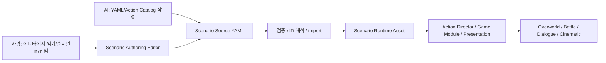

# 시나리오 저작 파이프라인 결정 메모

> 기준일: 2026-06-14  
> 목적: AI와 사람이 함께 관리할 Action Sequence / Battle Scenario Data 저작 규격 확정

## 결론

시나리오 저작은 `YAML Scenario Source + ScriptableObject Scenario Runtime Asset + Korean Scenario Authoring Editor` 하이브리드로 진행한다.

## 왜 이렇게 하는가

- 순수 `ScriptableObject`는 Unity 참조에는 좋지만 AI diff와 사람이 읽는 리뷰에는 불리하다.
- 순수 `JSON/XML/YAML` 런타임은 Unity 오브젝트 참조와 Inspector 안정성이 약하다.
- Unity `.asset` YAML은 GUID, fileID, managed reference 정보가 섞여 사람이 보는 저작 포맷으로 부적합하다.
- 하이브리드 구조는 AI가 안정적으로 고칠 수 있는 텍스트와 Unity가 안정적으로 실행할 수 있는 에셋을 분리한다.

## 작업자가 반드시 읽을 스킬

공유 스킬 원본:

- `.agents/skills/hubtohome-scenario-authoring/SKILL.md`

상세 참고:

- `references/scenario-source-format.md`: YAML 포맷, `when/do`, 병렬 실행, 검증 규칙
- `references/editor-and-sync.md`: 커스텀 에디터 UX, 동기화, stale 상태
- `references/action-catalog.md`: 액션 문법, 카테고리, 새 액션 추가 조건

## 유지 규칙

- 새 액션을 만들면 Action Catalog 항목도 같이 추가한다.
- 새 YAML 필드, 검증 규칙, import/export 규칙, editor behavior, runtime adapter가 생기면 스킬도 같은 변경 단위로 갱신한다.
- 사람이 직접 Unity `.asset` YAML을 고치는 방식은 기본 저작 방식이 아니다.
- 커스텀 에디터는 자연스러운 한국어 화면이어야 하며, 사람이 최소한 순서 변경과 중간 삽입은 안전하게 할 수 있어야 한다.
- 기존 `SkillData.ActionTimeline`과 `SkillActionBlock`은 전역 시나리오 문법의 루트가 아니라, QTE/스킬 실행을 새 Action Sequence 체계에 연결하기 위한 레거시/adapter 대상으로 본다.

## 2026-06-14 구현 진행 로그

- 최소 Spec Kit 산출물과 단계별 실행 계획을 추가했다.
- YAML parser는 YamlDotNet을 우선 후보로 두되, 실제 parser 호출은 `ScenarioSourceParser` adapter 뒤에 숨기기로 했다.
- 첫 Runtime Asset 데이터 모델을 추가했다.
  - `ScenarioActionData`
  - `ActionSequenceAsset`
  - `BattleEventRuleData`
  - `BattleScenarioData`
  - `ScenarioSourceMetadata`
- 첫 Action Catalog 데이터와 검증기를 추가했다.
  - `ActionCatalogAsset`
  - `ActionCatalogEntry`
  - `ActionCatalogParameter`
  - `ScenarioCatalogValidator`
  - `ScenarioValidationResult`
- 검증기 1차 범위는 필수 카탈로그 필드 누락, 중복 action id, 시퀀스의 미등록 action id 탐지다.
- 첫 Action Director 코어를 추가했다.
  - `ActionExecutionContext`
  - `ActionExecutionResult`
  - `ActionExecutionHandle`
  - `IActionAdapter`
  - `ActionAdapterRegistry`
  - `ActionDirector`
- `ActionDirector`는 일반 액션을 `ActionAdapterRegistry`에서 찾아 실행하고, `flow.parallel`은 현재 내장 병렬 그룹 액션으로 처리한다.
- 이번 병렬 실행기는 fake adapter와 frame-yield 기반 액션을 검증하는 1차 코어다. 실제 시간 대기, DOTween, DialogueManager, QTE 같은 presentation 액션은 이후 adapter/service 계층에서 다룬다.
- 첫 Source Sync 기반을 추가했다.
  - `ScenarioSourceDocument`
  - `ScenarioSourceParser`
  - `ScenarioSourceHash`
  - `ScenarioSourceImporter`
- 실제 YAML parser는 아직 붙이지 않았다. 현재는 `IScenarioSourceParser` / `MissingYamlScenarioSourceParser` 경계를 먼저 두고, fake parser 테스트로 ScriptableObject 런타임 에셋 동기화와 source hash/stale 판단을 검증한다.
- Unity Editor 강제 refresh/reimport는 하지 않았다. 새 Scenario 파일은 현재 `.csproj`에 아직 포함되지 않았으므로, `dotnet build`만으로 새 파일 전체 검증이 됐다고 보면 안 된다.
- 대신 Unity 6 NetStandard reference assembly와 `UnityEngine.CoreModule`을 직접 참조하는 별도 `csc` 컴파일로 Runtime Data/Catalog/Validator/ActionDirector/SourceSync 스크립트의 문법과 참조 오류가 없음을 확인했다.
- NUnit EditMode 테스트는 초안 파일을 추가했지만, 실제 실행은 Unity Test Runner에서 별도 검증해야 한다.
- Presentation action adapter 1차를 추가했다.
  - `flow.wait`: `duration` 파라미터만큼 Action Sequence를 멈춘다. 테스트에서는 `IActionClock`을 주입해 Unity 시간에 묶이지 않게 검증한다.
  - `dialogue.wait`: `IDialogueRunner`를 통해 대화를 시작하고 완료 콜백이 올 때까지 Action Sequence를 멈춘다.
  - `DialogueManagerRunner`: 기존 `DialogueManager`와 `DialogueData`를 등록형 ID로 감싼다. `DialogueManager`가 이미 재생 중이거나 시작에 실패하면 시퀀스가 무한 대기하지 않고 명확히 실패하게 한다.
- `DialogueManager`에는 기존 동작을 바꾸지 않는 읽기 전용 `IsPlaying`만 추가했다. 이 값은 scenario adapter가 기존 대화 시스템의 busy 상태를 안전하게 감지하기 위한 최소 seam이다.
- `Action Catalog` reference에 `flow.wait`, `dialogue.wait`의 한국어 표시명, 파라미터, 완료 조건, 취소 조건을 추가했다.
- Presentation adapter까지 포함한 Scenario production 스크립트는 별도 `csc` 컴파일로 오류가 없음을 확인했다. Unity Test Runner 실행은 에디터 refresh/reimport를 피하기 위해 아직 보류했다.
- Battle Event Rule Runner의 1차 순수 모듈을 추가했다.
  - `BattleEventData`: 전투 중 관측된 사건이다. 현재는 `EnemyHpCrossedBelow`와 HP 이전/현재 비율, 발화 timing, subject ID를 담는다.
  - `BattleScenarioSession`: 전투 안에서 이미 발화된 규칙과 Encounter Memory로 이어질 발화 기록을 추적한다.
  - `BattleScenarioTrigger`: evaluator가 발화시킨 `RuleId`, `SequenceId`, timing, source event를 담는다.
  - `BattleEventRuleEvaluator`: `BattleEventRuleData + BattleEventData + BattleScenarioSession`을 받아 발화 여부를 판단한다.
- HP threshold 규칙은 `previousHpRatio > threshold && currentHpRatio <= threshold`일 때만 발화한다. 이미 threshold 아래인 상태에서 추가로 피해를 받은 경우는 crossing이 아니므로 재발화하지 않는다.
- `PerEncounterMemory` once 규칙은 아직 저장 데이터에 연결하지 않았지만, 세션에서 import/export할 수 있게 해 이후 `Encounter Memory` 저장 경로와 연결할 수 있도록 했다.
- 이 단계에서도 기존 `BattleManager`는 수정하지 않았다. 다음 작업은 데미지/스킬 종료 지점에서 `BattleEventData`를 발행하고, evaluator가 반환한 `BattleScenarioTrigger`를 `ActionDirector`에 넘기는 얇은 hook이다.
- `BattleScenarioRuleRunner`를 추가해 `BattleScenarioData.Rules` 순서대로 event를 평가하고, 발화된 trigger의 `SequenceId`를 `BattleScenarioData.Sequences`에서 찾을 수 있게 했다.
- 이 runner 덕분에 이후 `BattleManager` hook은 “전투 이벤트 발행 -> runner 평가 -> sequence 실행 요청”만 하면 된다. rule 탐색, once 처리, sequence id 해석이 BattleManager로 새어 나오지 않는다.
- `BattleScenarioEventRouter`를 추가해 `Immediate` 이벤트는 바로 평가하고, `AfterCurrentSkill` 같은 이벤트는 queue에 보관했다가 해당 timing이 flush될 때 평가하도록 했다.
- 이 구조가 사용자가 제시한 예시의 핵심이다. 적 HP가 스킬 중 50% 아래로 내려가도 전환 연출은 스킬 도중 끼어들지 않고, 현재 스킬이 완전히 끝난 뒤 `Flush(AfterCurrentSkill)`에서 BGM/대사/페이드/모듈 전환 sequence로 넘어가면 된다.
- Battle Event Rule의 subject ID 설계를 추가했다.
  - 새 적 데이터는 `EnemyData.EnemyId`를 안정 ID로 가진다.
  - `BattleScenarioSubjectResolver`는 `EnemyData.EnemyId`를 우선 사용하고, 기존 에셋 마이그레이션 전에는 asset name / display name fallback을 제공한다.
  - `EnemyName`은 표시명에 가까우므로 장기적인 Scenario Source ID로 사용하지 않는다.
- `docs/plans/2026-06-14-battle-scenario-subject-id-implementation.md`에 subject ID와 후속 BattleManager hook 계획을 따로 남겼다.
- 기존 QTE 전투에서 Battle Scenario Event를 발행하는 최소 hook을 추가했다.
  - `BattleEncounterService.StartEncounter(..., BattleScenarioData battleScenarioData = null)`로 encounter별 scenario data를 넘길 수 있다. 기존 호출자는 옵션 파라미터 때문에 깨지지 않는다.
  - 전용 BattleScene 로드처럼 씬을 건너가는 경우에는 `GlobalDataManager.PendingBattleScenario`로 scenario data를 임시 전달한다. 이 값은 세이브 데이터가 아니라 전투 진입용 런타임 handoff다.
  - `BattleManager`는 전투 시작 시 `BattleScenarioRuntime`을 만들고, 적에게 피해가 들어간 뒤 subject ID, HP 전/후값, timing만 넘기는 adapter 역할을 한다.
  - `BattleScenarioRuntime`은 `BattleScenarioData`를 받아 HP 정수값을 ratio 이벤트로 변환하고, `BattleScenarioEventRouter` publish/flush와 sequence lookup을 감싼다.
  - `SkillActionBlocks`는 데미지 전 HP를 같이 넘기므로, 50% threshold 같은 규칙은 실제 피해 전/후 비율로 crossing을 판단한다.
  - 발화된 `BattleScenarioTrigger`는 `BattleManager.OnBattleScenarioTriggersReady` 이벤트로 외부에 알리고, 내부 실행은 `BattleScenarioActionBridge`가 `ActionDirector`로 넘긴다.
  - `BattleScenarioActionBridge`는 trigger의 `SequenceId`를 runtime sequence로 해석하고, 각 trigger마다 child `ActionExecutionHandle`을 만들어 순차 실행한다.
  - `BattleScenarioExecutionGate`는 ready trigger queue, deferred flush checkpoint, trigger emission, bridge 호출, 실행 결과 handle 보관을 맡는다.
  - `BattleManager`는 scenario event를 gate에 publish하고 flush checkpoint에서 gate를 기다릴 뿐이며, rule ID를 해석하거나 BGM/대사/페이드/모듈 전환 정책을 직접 갖지 않는다.
  - 현재 기본 registry는 `flow.wait`, `dialogue.wait`, `bgm.crossfade`, `screen.fade`, `module.switch`, `module.start`, `battle.skill.timeline`을 등록한다. 이후 추가 구현으로 battle context에는 dialogue/audio/screen/module/skill runner service가 주입된다. BGM clip ID는 `BattleScenarioData.AudioClips` 매핑 우선, `Resources` fallback 순서로 해석된다.
- `dialogue.wait`의 runtime content binding 경로를 추가했다.
  - `BattleScenarioData.Dialogues`는 전투 시나리오별 `DialogueId -> DialogueData` 참조 목록이다.
  - `ScenarioDialogueRegistry`는 이 목록을 검증/정리한 뒤 `DialogueManagerRunner`에 등록한다. 빈 ID, null reference는 무시하고, 중복 ID는 뒤쪽 유효 참조가 이긴다.
  - `BattleScenarioActionContextFactory`는 scenario ID, Primary Mode, Game Module, `IDialogueRunner` service를 조립한다. 따라서 `BattleManager`는 더 이상 dialogue runner 등록 규칙을 직접 알 필요가 없다.
  - Scenario Source importer 1차가 `dialogues` 매핑을 `BattleScenarioData.Dialogues`로 동기화한다. Source의 `DialogueDataId`는 `IScenarioDialogueReferenceResolver`를 통해 실제 `DialogueData`로 해석된다.
  - `AssetDatabaseScenarioDialogueReferenceResolver`가 에디터 기본 resolver다. YAML의 `dialogueData`는 `DialogueData` 에셋 이름 또는 `Assets/...` 경로로 쓸 수 있고, 중복 이름은 잘못된 대화 재생을 막기 위해 unresolved로 실패한다.
  - `ScenarioDialogueReferenceData.DialogueDataId`가 원본 `dialogueData` 값을 보존하고, `ScenarioSourceExporter`가 `BattleScenarioData`를 다시 `ScenarioSourceDocument`로 export한다.
  - `ScenarioSourceYamlWriter`가 이 document를 deterministic `.scenario.yaml` text로 직렬화한다. 현재 범위는 header, participants, `dialogues`, `audioClips`, `rules`, `sequences`, `flow.parallel`, action `ParametersJson`이다.
  - `ScenarioSourceYamlExportCommand`가 editor UI에서 호출할 text/file export 경로를 제공한다. 이 command는 `ScenarioSourceExporter -> ScenarioSourceYamlWriter`를 재사용하고, 런타임 asset metadata는 직접 mutate하지 않는다.
  - 아직 YamlDotNet parser round-trip, Korean Scenario Authoring Editor save/export UI는 연결하지 않았다. 에디터 저장 경로를 만들 때는 별도 writer/file save path를 만들지 말고 `ScenarioSourceYamlExportCommand`를 호출해야 한다.
- `ScenarioCatalogValidator.ValidateBattleScenario(...)`를 추가해 `dialogue.wait` ID 검증을 저작 단계에서 잡을 수 있게 했다.
  - 단일 `ValidateSequence(...)`는 action ID만 볼 수 있으므로 scenario-level registry가 필요한 검증에는 부족하다.
  - battle scenario 전체 검증은 catalog 검증, sequence action 검증, `BattleScenarioData.Dialogues` 기반 dialogue ID 검증을 함께 수행한다.
  - `flow.parallel` children에 들어간 중첩 `dialogue.wait`도 재귀적으로 검증한다.
- Audio/Screen/Module command action adapter의 첫 seam을 추가했다.
  - `bgm.crossfade`는 `IAudioActionRunner`, `screen.fade`는 `IScreenTransitionRunner`, `module.switch` / `module.start`는 `IGameModuleActionRunner`를 통해 실행된다.
  - 이 adapter들은 실제 싱글톤이나 씬 오브젝트를 직접 찾지 않는다. Battle context에서는 현재 `AudioManagerActionRunner`, `ScreenTransitionRunner`, `GameModuleActionRunner`가 concrete runner로 주입된다.
  - `AudioManagerActionRunner`는 `ScenarioAudioClipResolver`를 먼저 사용하고, 매핑이 없을 때 `ResourcesAudioClipResolver`로 후퇴한다. Scenario Source에는 `audioClips` 매핑을 추가해 stable audio ID와 실제 AudioClip 참조 ID를 분리했다.
  - `module.switch`와 `module.start`는 완료 후 `ActionExecutionContext.ModuleId`를 갱신한다.
  - 기본 battle scenario `ActionAdapterRegistry`에는 네 command adapter를 등록했지만, 실제 battle content에서 사용하려면 runner service 주입이 필요하다.
- 기존 SkillData timeline compatibility adapter의 첫 seam을 추가했다.
  - `battle.skill.timeline`은 기존 `SkillData.ActionTimeline` / `SkillActionBlock` 기반 QTE/스킬 흐름을 새 Action Sequence에서 호출하기 위한 action이다.
  - 실행은 `ISkillTimelineRunner` seam으로 위임한다. Action adapter는 stable `skill`, `actor`, optional `targets` ID를 넘기고, 현재 concrete runner인 `BattleSkillTimelineRunner`가 `SkillData`, `CharacterBase`, `SkillContext`로 resolve한다.
  - 이 작업은 기존 스킬 시스템을 새 전역 문법으로 갈아엎는 것이 아니라, 기존 기능을 상위 Scenario/Action architecture 안에서 호출 가능하게 만드는 호환 계층이다.
  - 전체 전투 phase 전환, 대사, 음악, 모듈 교체 같은 흐름은 여전히 `Battle Event Rule -> Action Sequence`가 소유하고, SkillData는 개별 스킬 연출/판정의 legacy timeline으로 유지한다.
- `BattleSkillTimelineRunner` concrete bridge를 추가했다.
  - `BattleManager`가 `BattleScenarioActionContextFactory`에 runner를 주입한다.
  - runner는 player를 `CharacterID` / display name / object name으로, enemy를 `EnemyData.EnemyId` / enemy name / object name으로 찾는다.
  - player skill list와 enemy normal/strong skill list에서 `SkillData`를 찾고, explicit `targets`가 없으면 `SkillData.TargetType` / `IsAoE` 기준으로 살아있는 기본 대상을 고른다.
  - 이 runner는 legacy `SkillActionBlock` 실행까지만 담당한다. 위치 복귀, 카메라 복구, 나레이션 대기, 턴 종료, phase/module transition은 주변 battle flow 또는 Action Sequence 책임이다.
- Encounter Memory 저장 경로 1차를 추가했다.
  - `EncounterMemorySaveData`는 `EncounterId`, `MeetCount`, `Defeated`, `SeenBeatIds`를 저장한다.
  - `SaveData.EncounterMemory`와 `GlobalDataManager` encounter memory API가 현재 저장 경로다. write는 명시적인 mutation API를 쓰고, bulk 조회인 `GetEncounterMemory()`는 deep-copy snapshot을 반환한다.
  - `BattleScenarioRuntime`은 `PerEncounterMemory` rule을 위해 저장된 seen beat IDs를 import하고, 새로 발화된 encounter rule IDs를 export할 수 있다.
  - 이 구조는 전투 중 저장 복구가 아니다. 전투가 끝난 뒤 저장 가능한 조우 기억을 남기기 위한 기반이다.
- Battle outro Encounter Memory hook을 추가했다.
  - `BattleEncounterMemoryRecorder`가 전투 시작 시 saved beat IDs를 runtime에 seed하고 meet count를 증가시킨다.
  - 전투 종료 시 runtime이 export한 fired rule IDs를 `GlobalDataManager.RememberEncounterBeatIds(...)`에 반영한다.
  - 승리한 전투는 `GlobalDataManager.MarkEncounterDefeated(...)`로 기록한다.
  - `BattleManager`는 저장 규칙을 직접 소유하지 않고 recorder Module만 호출한다.
- 1차 push 전 검증 강화를 위해 `BattleScenarioRuntimeTests`를 추가했다.
  - `AfterCurrentSkill` timing은 스킬 중 발생한 HP crossing을 즉시 실행하지 않고 flush 시점에 발화한다.
  - `Immediate` timing은 publish 시점에 바로 발화하고, 이후 flush에서 중복 발화하지 않는다.
  - 이 테스트는 BattleManager private helper가 아니라 public runtime Module을 검증하므로, 이후 battle adapter가 바뀌어도 핵심 규칙은 유지하기 쉽다.
  - 테스트 임시 `ScriptableObject`는 assertion 실패 시에도 정리되도록 `try/finally`로 감쌌다.

## 검증 메모

- 임시 validation csproj로 TDD RED를 먼저 확인했다. `BattleScenarioRuntimeTests`가 없는 타입을 참조해 실패했고, 이후 runtime Module 구현 뒤 같은 validation build가 오류 0개로 통과했다.
- `dotnet build HubToHome.sln --no-restore`는 Unity 생성 csproj가 갱신된 뒤 통과했다. 이전 전체 실행에서는 기존 계열 경고인 `System.Net.Http`/`System.IO.Compression` 버전 충돌과 `PlayerController._defenseReactionLocked` 미사용 경고가 있었고, 테스트 cleanup 보강 후 재실행에서는 `System.Net.Http`/`System.IO.Compression` 버전 충돌 4개만 남았다.
- Unity MCP EditMode 테스트를 실행했고, 새 `BattleScenarioRuntimeTests` 포함 총 36개 테스트가 모두 통과했다.
- 첫 Test Runner 실행에는 Unity import 타이밍 때문에 cleanup verification 로그가 남았다. 두 번째 실행에서 테스트 결과는 36개 통과, 실패 0개였다.
- 테스트 cleanup 보강 후 `BattleScenarioRuntimeTests`만 다시 실행했고 2개 통과, 실패 0개였다.
- `BattleScenarioActionBridgeTests`는 RED에서 타입 부재 컴파일 오류를 확인한 뒤 구현했고, 최종 2개 통과, 실패 0개였다.
- 최종 Unity MCP EditMode 전체 테스트는 38개 통과, 실패 0개였다.
- 이후 아키텍처 유연성 검증을 위해 `docs/plans/2026-06-14-scenario-architecture-test-matrix.md`를 추가하고 실제 EditMode 테스트 12개를 보강했다.
  - trigger 목록이 비어 있거나 null entry가 섞여도 안전하다.
  - 여러 trigger는 순서대로 실행된다.
  - child action 실패와 parent cancellation이 명확히 전파된다.
  - child context에는 scenario / Primary Mode / Game Module 정보가 유지된다.
  - invalid HP, wrong subject, already-below-threshold, missing sequence, null scenario는 모두 safe no-op 또는 명확한 실패로 처리된다.
- 최신 Unity MCP EditMode 전체 테스트는 50개 통과, 실패 0개다.
- `ScenarioDialogueRegistryTests`와 `BattleScenarioActionContextFactoryTests`를 추가했고, 최신 Unity MCP EditMode 전체 테스트는 55개 통과, 실패 0개다.
- `BattleScenarioValidationTests`를 추가했고, 최신 Unity MCP EditMode 전체 테스트는 59개 통과, 실패 0개다.
- `ScenarioPresentationCommandAdapterTests`를 추가했고, 최신 Unity MCP EditMode 전체 테스트는 63개 통과, 실패 0개다.
- `ScenarioSkillTimelineAdapterTests`를 추가했다. `battle.skill.timeline` runner 호출/대기, runner 누락, `skill` 누락, 잘못된 `targets` 타입 실패를 검증한다.
- 최초 검증에서 `scope=scripts` refresh가 새 script file import를 잡지 못해 `BattleSkillTimelineActionAdapter` 타입 부재 컴파일 오류가 났다. 이후 비강제 `refresh_unity mode=if_dirty scope=all compile=request`로 새 파일이 project에 편입됐고 오류가 해소됐다.
- `dotnet build HubToHome.sln --no-restore`와 `git diff --check`는 통과했다. 기존 `System.Net.Http`/`System.IO.Compression` 버전 충돌과 `PlayerController._defenseReactionLocked` 미사용 경고는 남아 있다.
- 최신 Unity MCP EditMode 전체 테스트는 67개 통과, 실패 0개다. Unity 콘솔에는 테스트 실패가 아닌 MCP disposed client handler 로그 2개와 TestResults.xml 저장 로그가 남았다.
- `BattleSkillTimelineRunnerTests`를 추가했고, actor/target/skill resolve 성공과 실패 경로를 검증했다.
- EditMode 테스트에서 `PlayerCharacter.Awake`가 보장되지 않아 테스트 fixture의 player HP가 0이 되는 문제를 발견했고, fixture에서 HP/MP를 명시 초기화하도록 보정했다. 이는 런타임 버그가 아니라 EditMode 하네스 초기화 차이다.
- 최신 Unity MCP EditMode 전체 테스트는 73개 통과, 실패 0개다.
- `EncounterMemorySaveTests` 5개를 추가했고, save/load deep copy, bulk snapshot copy, remembered beat seed, fired beat export가 통과했다.
- 최신 Unity MCP EditMode 전체 테스트는 78개 통과, 실패 0개다.
- `dotnet build HubToHome.sln --no-restore`와 `git diff --check`는 통과했다. 남은 경고는 기존 계열인 `System.Net.Http` / `System.IO.Compression` 버전 충돌과 `PlayerController._defenseReactionLocked` 미사용 경고다.
- `BattleEncounterMemoryRecorderTests` 4개를 추가했고, meet count 증가, saved memory seed, victory defeated 기록, fallback encounter ID 기록이 통과했다.
- 최신 Unity MCP EditMode 전체 테스트는 82개 통과, 실패 0개다.
- `dotnet build HubToHome.sln --no-restore`와 `git diff --check`는 다시 통과했다. 남은 경고는 기존 계열 5개다.
- `ScenarioSourceSyncTests`에 YAML writer 2개 테스트를 추가했다. readable `.scenario.yaml` text export, `dialogues`, `audioClips`, `rules`, `flow.parallel`, primitive array, quoted string parameter, invalid action JSON validation을 검증한다.
- `ScenarioSourceSyncTests`에 YAML export command 2개 테스트를 추가했다. target path 파일 쓰기와 missing target path validation을 검증한다.
- 최신 검증에서 `dotnet build HubToHome.sln --no-restore`, `git diff --check`, C# LSP diagnostics는 통과했다. Unity MCP targeted EditMode 테스트는 `ScenarioSourceSyncTests` job 시작 후 결과 조회 시점에 `No Unity Editor instances found`로 브리지가 끊겨 완료 결과를 회수하지 못했다.
- `ScenarioSourceSyncTests` 2개를 보강했고, source `dialogues` import와 unresolved `DialogueDataId` validation이 통과했다.
- 최신 Unity MCP EditMode 전체 테스트는 84개 통과, 실패 0개다.
- `dotnet build HubToHome.sln --no-restore`와 `git diff --check`는 통과했다. 남은 것은 기존 계열 경고 5개와 MCP disposed 로그 1개다.
- `AssetDatabaseScenarioDialogueReferenceResolverTests` 6개를 추가했다. 에셋 이름 resolve, `Assets/...` 경로 resolve, 중복 이름 실패, 잘못된 search folder가 전체 검색으로 넓어지지 않는 정책, export용 asset name/path provider 정책을 검증한다.
- C# LSP diagnostics와 `dotnet build HubToHome.sln --no-restore`로 새 resolver/test의 컴파일 안정성을 확인했다.
- Unity MCP targeted EditMode 테스트와 전체 EditMode 테스트는 후속 export 검증까지 포함해 최신 92개 통과, 실패 0개다. 콘솔에는 테스트 실패가 아닌 기존 MCP disposed client handler 로그와 PerformanceTesting setup/cleanup 로그만 남았다.
- Source export TDD RED에서 `IScenarioDialogueReferenceIdProvider` 부재로 빌드 실패를 확인했고, `ScenarioSourceExporter` / `DialogueDataId` 보존 / provider 구현 뒤 GREEN으로 전환했다.
- 최신 Unity MCP targeted EditMode 테스트는 `ScenarioSourceSyncTests`와 `AssetDatabaseScenarioDialogueReferenceResolverTests` 합산 13개 통과, 전체 EditMode 테스트는 92개 통과, 실패 0개다. 콘솔에는 테스트 실패가 아닌 기존 MCP disposed client handler 로그와 PerformanceTesting setup/cleanup 로그만 남았다.
- `BattleScenarioExecutionGate`를 추가해 trigger 실행 정책을 `BattleManager` 밖으로 더 빼냈다.
  - 기존에는 발화 지점에서 bridge coroutine을 직접 시작하거나 flush에서 직접 bridge를 기다리는 형태였다.
  - 이제는 gate가 ready trigger queue와 flush checkpoint 실행을 소유한다.
  - 이 구조는 이후 QTE 전투 외의 shooter/boxing Game Module에서도 같은 scenario execution 정책을 재사용하기 위한 준비다.
  - 이번 턴은 테스트 추가보다 아키텍처 정리에 집중했으므로, 신규 테스트 추가는 하지 않았다. 검증은 C# LSP diagnostics, `dotnet build HubToHome.sln --no-restore`, Unity MCP EditMode 전체 92개 통과로 수행했다.
- `GameModuleActionRunner` 기반을 추가했다.
  - `IGameModuleRuntime`은 각 Game Module이 `Enter`, `Exit`, `Start`를 구현하는 계약이다.
  - `GameModuleRegistry`는 `turn_qte`, `aim_shooter`, `boxing` 같은 stable module ID를 runtime 구현에 매핑한다.
  - `GameModuleActionRunner`는 `module.switch` / `module.start` 액션이 호출하는 공통 runner이며, 현재 모듈 exit, 대상 모듈 enter/start, active module ID 갱신을 담당한다.
  - `BattleScenarioActionContextFactory`가 선택적으로 `IGameModuleActionRunner`를 주입받을 수 있게 되어, 이후 Battle 또는 Overworld context가 concrete module registry를 공급할 수 있다.
  - 이 단계는 QTE/슈팅/권투 모듈 자체 구현이 아니라, 해당 모듈들을 `BattleManager` 분기 없이 꽂기 위한 runtime contract 정리다.
  - `dotnet build HubToHome.sln --no-restore`, `git diff --check`, C# LSP diagnostics는 통과했다.
  - Unity MCP `refresh_unity if_dirty`로 새 스크립트의 `.meta` 생성은 확인했다. targeted EditMode 테스트 잡은 시작됐지만, 결과 조회 시 MCP 브리지가 `No Unity Editor instances found` 상태로 끊겨 최종 테스트 결과를 회수하지 못했다.
- `turn_qte` compatibility module을 battle context에 연결했다.
  - `BattleManager`가 `BattleScenarioActionContextFactory`를 호출할 때 `GameModuleActionRunner`를 함께 주입한다.
  - 현재 registry에는 `BattleTurnQteGameModuleRuntime` 하나가 `turn_qte` ID로 등록된다.
  - 이 module은 active QTE 중단, 타겟팅 커서/전투 메뉴/서브메뉴/방어 QTE UI 정리, party panel 위치 복구, battle UI 정규화를 담당한다.
  - 이 정리는 `BattleUIController.SuspendBattleModuleInput()` / `ResumeBattleModuleInput()`과 `BattleMenuUI.SuspendForModuleSwitch()`를 통해 이루어진다.
  - 아직 턴 계산, 플레이어 행동 선택, 적 행동, Battle Session State를 `BattleManager` 밖으로 꺼낸 것은 아니다.
  - 추가 변경 후 `dotnet build HubToHome.sln --no-restore`, `git diff --check`, C# LSP diagnostics가 통과했다.
- Play Mode, 씬 저장, `.unity` 직접 편집은 하지 않았다.

## 다음 구현 후보

1. YamlDotNet-backed `IScenarioSourceParser` 구현
2. Scenario Source YAML export command를 Korean Scenario Authoring Editor save/export 버튼에 연결하고 `dialogues` 매핑을 source로 저장하는 경로 구현
3. 현재 QTE 전투의 턴/행동 선택/적 행동 상태를 단계적으로 `IGameModuleRuntime` 뒤로 옮기는 `turn_qte` concrete module 심화
4. Battle Scenario Execution Gate의 module-transition 중 턴 진행 차단을 실제 sample scenario로 검증
5. Scenario Source YAML export command를 Korean Scenario Authoring Editor save/export 버튼에 연결하고 `audioClips` 매핑을 저장/편집하는 경로 구현
6. `battle.skill.timeline`을 실제 scenario sequence 안에서 사용하는 ZEV 전환 샘플 작성
7. UI Toolkit 기반 Scenario Authoring Editor 1차 구현
