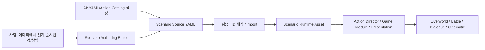

# 시나리오 저작 파이프라인 결정 메모

> 기준일: 2026-06-14  
> 목적: AI와 사람이 함께 관리할 Action Sequence / Battle Scenario Data 저작 규격 확정

## 결론

시나리오 저작은 `YAML Scenario Source + ScriptableObject Scenario Runtime Asset + Korean Scenario Authoring Editor` 하이브리드로 진행한다.

## 왜 이렇게 하는가

- 순수 `ScriptableObject`는 Unity 참조에는 좋지만 AI diff와 사람이 읽는 리뷰에는 불리하다.
- 순수 `JSON/XML/YAML` 런타임은 Unity 오브젝트 참조와 Inspector 안정성이 약하다.
- Unity `.asset` YAML은 GUID, fileID, managed reference 정보가 섞여 사람이 보는 저작 포맷으로 부적합하다.
- 하이브리드 구조는 AI가 안정적으로 고칠 수 있는 텍스트와 Unity가 안정적으로 실행할 수 있는 에셋을 분리한다.

## 작업자가 반드시 읽을 스킬

공유 스킬 원본:

- `.agents/skills/hubtohome-scenario-authoring/SKILL.md`

상세 참고:

- `references/scenario-source-format.md`: YAML 포맷, `when/do`, 병렬 실행, 검증 규칙
- `references/editor-and-sync.md`: 커스텀 에디터 UX, 동기화, stale 상태
- `references/action-catalog.md`: 액션 문법, 카테고리, 새 액션 추가 조건

## 유지 규칙

- 새 액션을 만들면 Action Catalog 항목도 같이 추가한다.
- 새 YAML 필드, 검증 규칙, import/export 규칙, editor behavior, runtime adapter가 생기면 스킬도 같은 변경 단위로 갱신한다.
- 사람이 직접 Unity `.asset` YAML을 고치는 방식은 기본 저작 방식이 아니다.
- 커스텀 에디터는 자연스러운 한국어 화면이어야 하며, 사람이 최소한 순서 변경과 중간 삽입은 안전하게 할 수 있어야 한다.
- 기존 `SkillData.ActionTimeline`과 `SkillActionBlock`은 전역 시나리오 문법의 루트가 아니라, QTE/스킬 실행을 새 Action Sequence 체계에 연결하기 위한 레거시/adapter 대상으로 본다.

## 2026-06-14 구현 진행 로그

- 최소 Spec Kit 산출물과 단계별 실행 계획을 추가했다.
- YAML parser는 YamlDotNet을 우선 후보로 두되, 실제 parser 호출은 `ScenarioSourceParser` adapter 뒤에 숨기기로 했다.
- 첫 Runtime Asset 데이터 모델을 추가했다.
  - `ScenarioActionData`
  - `ActionSequenceAsset`
  - `BattleEventRuleData`
  - `BattleScenarioData`
  - `ScenarioSourceMetadata`
- 첫 Action Catalog 데이터와 검증기를 추가했다.
  - `ActionCatalogAsset`
  - `ActionCatalogEntry`
  - `ActionCatalogParameter`
  - `ScenarioCatalogValidator`
  - `ScenarioValidationResult`
- 검증기 1차 범위는 필수 카탈로그 필드 누락, 중복 action id, 시퀀스의 미등록 action id 탐지다.
- 첫 Action Director 코어를 추가했다.
  - `ActionExecutionContext`
  - `ActionExecutionResult`
  - `ActionExecutionHandle`
  - `IActionAdapter`
  - `ActionAdapterRegistry`
  - `ActionDirector`
- `ActionDirector`는 일반 액션을 `ActionAdapterRegistry`에서 찾아 실행하고, `flow.parallel`은 현재 내장 병렬 그룹 액션으로 처리한다.
- 이번 병렬 실행기는 fake adapter와 frame-yield 기반 액션을 검증하는 1차 코어다. 실제 시간 대기, DOTween, DialogueManager, QTE 같은 presentation 액션은 이후 adapter/service 계층에서 다룬다.
- 첫 Source Sync 기반을 추가했다.
  - `ScenarioSourceDocument`
  - `ScenarioSourceParser`
  - `ScenarioSourceHash`
  - `ScenarioSourceImporter`
- 실제 YAML parser는 아직 붙이지 않았다. 현재는 `IScenarioSourceParser` / `MissingYamlScenarioSourceParser` 경계를 먼저 두고, fake parser 테스트로 ScriptableObject 런타임 에셋 동기화와 source hash/stale 판단을 검증한다.
- Unity Editor 강제 refresh/reimport는 하지 않았다. 새 Scenario 파일은 현재 `.csproj`에 아직 포함되지 않았으므로, `dotnet build`만으로 새 파일 전체 검증이 됐다고 보면 안 된다.
- 대신 Unity 6 NetStandard reference assembly와 `UnityEngine.CoreModule`을 직접 참조하는 별도 `csc` 컴파일로 Runtime Data/Catalog/Validator/ActionDirector/SourceSync 스크립트의 문법과 참조 오류가 없음을 확인했다.
- NUnit EditMode 테스트는 초안 파일을 추가했지만, 실제 실행은 Unity Test Runner에서 별도 검증해야 한다.
- Presentation action adapter 1차를 추가했다.
  - `flow.wait`: `duration` 파라미터만큼 Action Sequence를 멈춘다. 테스트에서는 `IActionClock`을 주입해 Unity 시간에 묶이지 않게 검증한다.
  - `dialogue.wait`: `IDialogueRunner`를 통해 대화를 시작하고 완료 콜백이 올 때까지 Action Sequence를 멈춘다.
  - `DialogueManagerRunner`: 기존 `DialogueManager`와 `DialogueData`를 등록형 ID로 감싼다. `DialogueManager`가 이미 재생 중이거나 시작에 실패하면 시퀀스가 무한 대기하지 않고 명확히 실패하게 한다.
- `DialogueManager`에는 기존 동작을 바꾸지 않는 읽기 전용 `IsPlaying`만 추가했다. 이 값은 scenario adapter가 기존 대화 시스템의 busy 상태를 안전하게 감지하기 위한 최소 seam이다.
- `Action Catalog` reference에 `flow.wait`, `dialogue.wait`의 한국어 표시명, 파라미터, 완료 조건, 취소 조건을 추가했다.
- Presentation adapter까지 포함한 Scenario production 스크립트는 별도 `csc` 컴파일로 오류가 없음을 확인했다. Unity Test Runner 실행은 에디터 refresh/reimport를 피하기 위해 아직 보류했다.

## 다음 구현 후보

1. YamlDotNet-backed `IScenarioSourceParser` 구현
2. Battle Event Rule runner와 `BattleScenarioSession` 작성
3. `enemy.hp_crossed_below` / `after_current_skill`를 표현하는 이벤트 모델 작성
4. Audio/Screen/Module 전환용 presentation service seam 설계
5. 기존 QTE 스킬 하나를 adapter로 실행하는 수직 검증
6. UI Toolkit 기반 Scenario Authoring Editor 1차 구현
