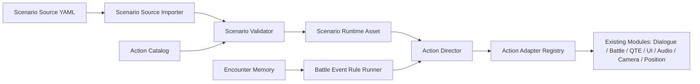

# Scenario Authoring Architecture Plan

## Architecture Summary

Create deep Modules around Scenario Source sync, Action Catalog validation, Scenario Runtime Assets, Action Director execution, and adapters to existing game systems. Existing battle, dialogue, QTE, UI, audio, camera, and movement systems remain in place while new Modules provide a smaller Interface for scenario authors and tests.

## Deep Modules

### Scenario Source Sync Module

Interface:

- Import source text into a neutral document model.
- Validate document model against Action Catalog and id registries.
- Synchronize to Scenario Runtime Assets.
- Export light editor edits back to source.

Implementation:

- YAML parser adapter.
- Source hash/stale metadata.
- Import/export commands under Unity Editor.

### Action Catalog Module

Interface:

- Lookup action definitions by id.
- Validate required parameters and known parameter types.
- Provide Korean display labels and examples for editor search.

Implementation:

- ScriptableObject catalog asset.
- Pure C# validation helpers.
- Optional generated catalog source later.

### Action Director Module

Interface:

- Play an Action Sequence with an Action Execution Context.
- Support sequence, parallel group, wait, cancellation, and completion result.
- Keep runtime execution independent of Primary Mode.

Implementation:

- Coroutine-backed runner.
- Adapter registry.
- Execution handles and cancellation tokens.

### Battle Scenario Module

Interface:

- Consume Battle Session State, Encounter Memory, and Battle Events.
- Decide whether a Battle Event Rule should fire.
- Ask Action Director to run the configured sequence.

Implementation:

- Battle rule evaluator.
- Fired-rule tracking.
- Initial adapter hooks from `BattleManager.InvokeDamageEvent` and skill-end timing.

### Scenario Authoring Editor Module

Interface:

- Display scenario overview, rules, sequences, catalog, validation, and sync state.
- Allow safe reorder/insert/duplicate/delete and small field edits.
- Synchronize edits back to source/runtime.

Implementation:

- UI Toolkit EditorWindow.
- USS style file.
- Validation panel.

## Implementation Phases

1. **Data Model and Catalog:** Add runtime asset data classes and catalog validation with EditMode tests.
2. **Action Director Core:** Add sequence execution, parallel groups, handles, cancellation, and tests.
3. **Source Sync:** Add YAML parser adapter decision, import/export, source hash, and stale validation.
4. **Presentation Adapters:** Add waitable dialogue, screen fade placeholder, audio placeholder, and actor movement adapter plan.
5. **Battle Scenario Runner:** Add rule data, evaluator tests, and minimal `BattleManager` hook adapter.
6. **Legacy QTE Skill Bridge:** Wrap existing `SkillData.ActionTimeline` without renaming serialized classes.
7. **Korean Editor:** Build first UI Toolkit editor over the validated model.
8. **Vertical Slice:** Create one sample scenario for a ZEV-like phase transition and verify through tests plus manual Unity validation when approved.

## Validation Strategy

- Use EditMode tests for all pure data, validation, parsing, execution-order, and rule-evaluation behavior.
- Avoid Play Mode until a vertical runtime slice needs manual validation.
- Do not touch `.unity` scenes or existing assets in early phases.
- Use C# diagnostics or Unity console after script changes.

## Open Decisions

- YAML parser packaging: choose a Unity-safe YamlDotNet import path or document a constrained fallback before implementing import/export.
- Exact source file location under `Assets/_Game`: likely `Assets/_Game/Features/Scenario/Source`.
- Whether generated Scenario Runtime Assets live beside source files or under `Assets/_Game/Features/Scenario/Generated`.
