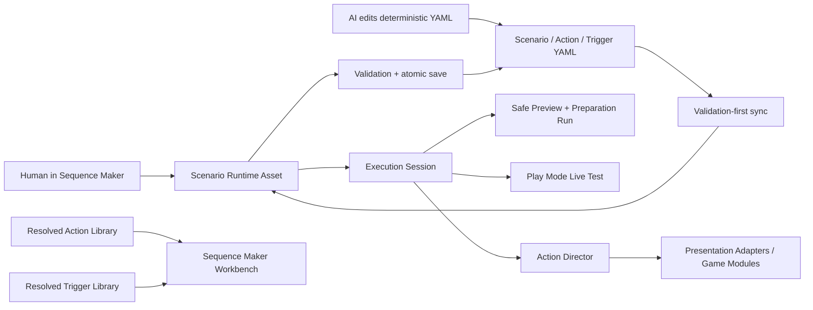

# Sequence Maker Workbench Plan

## Architecture Summary

Build additive authoring and runtime foundations before replacing the current editor. Stable Block IDs, typed sequence contracts, YAML-backed libraries, extensible Trigger Rules, observable execution, and safe save/preview Modules become the deep interfaces used by one official UI Toolkit workbench.

## Modules

### Authoring Identity And Contracts

- Stable Block ID and sequence metadata.
- Typed Sequence Inputs and deterministic bindings.
- Sequence call graph and usage index.

### Action And Trigger Libraries

- Category-scoped YAML sources.
- Validation-first generated Unity assets.
- Resolved lookup with duplicate and adapter consistency diagnostics.

### Runtime Orchestration

- Scenario Event and Trigger Condition evaluation.
- Compatibility mapping from fixed Battle Event data.
- Observable Execution Session and structured parallel execution.
- Preparation Run separate from production Action execution.

### Editing And Sync

- Command-based edits over live Runtime Assets.
- Validated explicit source save, source conflict detection, and recovery.
- Existing validation-first import and object identity preservation.

### Workbench UI

- UI Toolkit shell using UXML and USS.
- Unified navigation, vertical flow canvas, Action picker, typed inspector, rule editor, preview/live controls, and Problems drawer.

## Delivery Order

1. Baseline and compatibility safety.
2. Block identity and source metadata.
3. Typed inputs, bindings, and sequence calls.
4. YAML-backed Action Library and production definitions.
5. Scenario Events, Conditions, Trigger Library, and battle compatibility.
6. Execution Session and Preparation Run.
7. Command stack and safe save coordinator.
8. UI Toolkit workbench shell and navigation.
9. Flow canvas, Action picker, inspector, and rule editor.
10. Preview/live integration, save/recovery UX, and legacy editor retirement.
11. Full Unity verification and architecture deepening review.

## Validation Strategy

- Pure EditMode tests for identity, parsing, validation, resolution, triggers, command history, save, and execution state.
- Existing scenario and battle tests after every migration batch.
- Unity MCP window, console, and Play Mode validation for UI and runtime context behavior.
- Overworld subway and cloned ZEV transitions as vertical slices.
- Scoped diff checks that preserve unrelated worktree changes.
